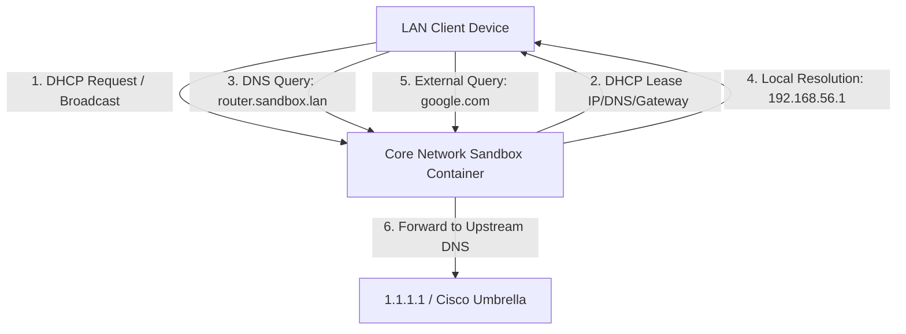

# Docker-based Core Network Services Sandbox

A complete, isolated laboratory environment designed to simulate and study core network infrastructure services (DNS and DHCP). This project is heavily inspired by the foundational concepts covered in the **Cisco Networking Basics** curriculum, mapping abstract Layer 3, Layer 4, and Layer 7 mechanisms into tangible containers.

---

## Technical Architecture

The architecture mimics a standard Local Area Network (LAN) environment with a designated gateway, static service points, and a dynamic IP allocation pool.

| Component | Address / Value |
|-----------|-----------------|
| **Network Domain** | `sandbox.lan` |
| **Subnet** | `192.168.56.0/24` |
| **Gateway (Simulated)** | `192.168.56.1` |
| **Core Server (DNS/DHCP)** | `192.168.56.10` |
| **DHCP Address Pool** | `192.168.56.50` - `192.168.56.150` |

---

## Network Flow



---

## Features Demonstrated

- Infrastructure as Code (IaC) using Docker Compose.
- Simulation of enterprise DNS and DHCP services.
- Authoritative DNS zone for local infrastructure.
- Recursive DNS forwarding to upstream public resolvers.
- DHCP address allocation following common enterprise network layouts.
- Containerized networking for isolated testing.
- Continuous Integration (CI) using GitHub Actions.
- Clean project structure suitable for learning and demonstration purposes.

---

## Prerequisites

Before deploying the sandbox, ensure the following software is installed:

- Docker Engine **20.10.0** or newer
- Docker Compose V2
- Network utilities such as:
  - `dig`
  - `nslookup`
  - `curl`

---

# Getting Started

## 1. Clone the Repository

```bash
git clone https://github.com/YOUR_GITHUB_USERNAME/docker-network-services-sandbox.git
cd docker-network-services-sandbox
```

---

## 2. Deploy the Environment

Start all services in detached mode.

```bash
docker compose up -d
```

---

## 3. Verify Container Status

Ensure the containers are healthy and running.

```bash
docker compose ps
```

Expected output:

```
NAME        STATUS
dns-dhcp    Up
```

---

## 4. View Runtime Logs

Observe DHCP negotiations and DNS queries in real time.

```bash
docker compose logs -f
```

---

# Verification Tests

## Test Local DNS Resolution

Verify that the local DNS server resolves internal records.

```bash
dig @127.0.0.1 router.sandbox.lan
```

Expected result:

```
router.sandbox.lan.    IN    A    192.168.56.1
```

---

## Test External DNS Forwarding

Verify that recursive queries are forwarded to the configured upstream resolver.

```bash
nslookup cisco.com 127.0.0.1
```

Expected behavior:

The query should successfully resolve the public IP addresses for `cisco.com`.

---

## Verify DHCP Service

Depending on your operating system, request a new DHCP lease from the sandbox network and verify that:

- An IP address is assigned from the configured pool.
- The gateway is set to `192.168.56.1`.
- The DNS server is `192.168.56.10`.

---

# Repository Structure

```text
.
├── .github/
│   └── workflows/
│       ├── ci.yml
│       ├── markdown-lint.yml
│       └── security.yml
│
├── config/
│   ├── named.conf
│   ├── db.sandbox.lan
│   └── dhcpd.conf
│
├── docker-compose.yml
├── Dockerfile
├── README.md
└── LICENSE
```

---

# Learning Objectives

This sandbox provides practical experience with:

- DNS fundamentals
- DHCP operations
- Container networking
- Docker Compose orchestration
- Linux network services
- Infrastructure as Code (IaC)
- Enterprise network architecture concepts
- Cisco Networking Basics principles

---

# Continuous Integration

Every push and pull request automatically executes GitHub Actions workflows that validate:

- YAML syntax
- Markdown formatting
- Docker configuration
- Repository integrity

This helps ensure that the project remains functional, consistent, and production-quality.

---

# Future Improvements

Possible enhancements include:

- DNSSEC support
- IPv6 networking
- Dynamic DNS updates
- Multiple VLAN simulations
- PXE boot services
- High Availability (HA) DNS
- Logging dashboards with Grafana
- Monitoring using Prometheus
- Integration with Pi-hole
- Support for multiple network segments

---

# License

This project is licensed under the **MIT License**.

See the `LICENSE` file for additional information.

---

## Author

**Roberto Delgado**

Senior Cybersecurity Consultant

Cybersecurity | Cloud Security | DevSecOps | Infrastructure Security | Security Automation
